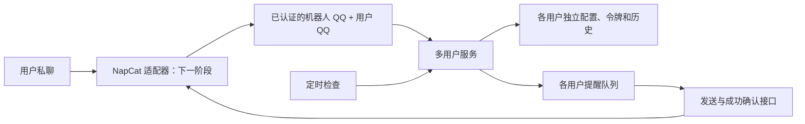

# 多用户电费服务

当前阶段实现多用户宿舍普通用电查询和监控，预留 NapCat OneBot 11 边界。
本机管理员可为不同 QQ 用户分别配置、完成学校验证、查询和设置提醒。
提醒会写入持久化发送队列；此版本尚未登录 QQ、自动加好友或实际发送 QQ 消息。
原有单用户命令和 `.local/electricity` 继续独立使用。

## 结构和身份



租户身份为 `(bot_id, user_id)`，由本机管理员或经过认证的适配器提供。
每个身份对应随机目录 ID；QQ 号和学号不拼成文件路径。
用户命令只接受查询、状态、本人历史、提醒设置和解绑，不能传入另一用户的 QQ、配置路径、
Token 或消息收件人。换一个机器人后，同一 QQ 用户也是新的独立绑定。

默认数据位于项目内：

```text
.local/service/
  registry.sqlite3        # QQ 身份与内部目录 ID；不存密码、Token
  registry.lock
  locks/<随机ID>.lock     # 稳定的每用户操作锁，解绑后保留空锁文件
  users/<随机ID>/
    config.yaml           # 该用户的账号、独立设备 ID、宿舍目标
    auth.json             # 该用户自己的 access_token / refresh_token
    history.sqlite3       # 该用户历史、设置、提醒队列和冷却记录
  worker.log              # 检查数量、失败数量等汇总，不输出用户凭据
```

Linux 上服务和用户目录权限 700，凭据及数据库文件权限 600。
传入配置的 `auth.cache` 强制替换为该用户目录内的 `auth.json`，并生成新的设备 ID。
同一用户的查询、修改、解绑及发送使用跨进程锁；其他用户仍可操作。
这是服务层和文件目录隔离，服务主机管理员能访问文件；磁盘上的密码目前未做额外加密。
Windows 部署需给服务账号配置相应的目录 ACL。

## 本机建立和验证绑定

```bash
bash scripts/build.sh
bash scripts/service.sh init
mkdir -p .local/onboarding
cp config.example.yaml .local/onboarding/user.yaml
chmod 600 .local/onboarding/user.yaml
```

在本机编辑 `.local/onboarding/user.yaml`，填写该用户自己的 `cas.username/password` 和
`dorm_electricity` 目标。学校密码和验证码不通过聊天或命令参数提交。
以下 QQ 号只是示例，应换为实际机器人和用户 QQ：

```bash
bash scripts/service.sh cli bind --bot 90001 --qq 10001 --config .local/onboarding/user.yaml
bash scripts/service.sh cli login --bot 90001 --qq 10001 --trust-device
bash scripts/service.sh cli query --bot 90001 --qq 10001
bash scripts/service.sh cli status --bot 90001 --qq 10001
```

首次服务绑定生成独立设备标识，通常要完成学校二次验证；验证码只在服务主机终端输入。
学校可能在授信设备达到上限时移除最早设备。之后令牌刷新和受信设备登录仅使用该用户凭据。
本地 OAuth 响应也可用 `cli import-auth --bot ... --qq ... --input ...` 导入；
需要时加 `--client-auth-file` 指向一行 Basic 认证头的私有文件。

状态依次为：`pending`（配置或认证已准备）、`active`（目标查询成功），
遇到学校重新验证为 `needs_auth`，无效目标为 `invalid_target`。
只有成功查询的 `active` 用户才进入自动检查，避免把“配置已写入”误当成“绑定验证成功”。
重新登录后再查询一次即可恢复监控。一个用户需要验证时，不影响其他用户。

此阶段的建立绑定命令属于管理员操作。面向校友的自助绑定入口、一次性绑定链接及短信会话
将在 QQ 接入阶段实现，不应把本机管理员命令直接映射为聊天命令。
源配置由管理员提供；解绑会删除服务内的副本，管理员应另外清理源配置及其备份。

## 查询、提醒和监控

```bash
bash scripts/service.sh cli query --bot 90001 --qq 10001
bash scripts/service.sh cli history --bot 90001 --qq 10001 --limit 20
bash scripts/service.sh cli preferences --bot 90001 --qq 10001 --threshold 8 --interval 21600 --repeat-after 86400
bash scripts/service.sh cli preferences --bot 90001 --qq 10001 --disable
bash scripts/service.sh cli preferences --bot 90001 --qq 10001 --enable
bash scripts/service.sh cli outbox --bot 90001 --qq 10001
bash scripts/service.sh cli unbind --bot 90001 --qq 10001
```

默认阈值 10 度，电量 **小于或等于** 阈值时提醒；默认每 6 小时检查，同一低电量状态最多每日提醒。
检查间隔允许 5 分钟至 7 天，重复提醒间隔允许 1 小时至 7 天。
手动查询每用户至少间隔 10 秒。阈值采用十进制字符串，失败不会当作 0 度。
关闭提醒同时关闭该用户的自动检查，并取消尚未发送的提醒；手动查询仍可使用。

```bash
bash scripts/service.sh cli tick    # 单轮检查
bash scripts/service.sh cli run     # 前台运行，Ctrl+C 停止
bash scripts/service.sh start       # Linux 用户 systemd 后台服务
bash scripts/service.sh status
bash scripts/service.sh stop
```

每轮最多 4 个并行查询，用户操作锁防止同一用户被两个进程重复检查。
网络失败安排 5 分钟后重试，不触发短信、不消耗低电量冷却；学校认证失效只暂停该用户。
systemd 脚本创建用户临时服务，没有安装系统包或设置开机自启。
尚未接入发送适配器时，服务会持续检查并保留队列，**不将排队状态记为 QQ 已送达**。

## 提醒发送接口

`NotificationSink::send_private` 是后续发送适配器的实现位置。
`Service::dispatch` 在每次发送前读取注册表中的收件人，并持有该用户操作锁，
防止解绑、余额恢复或关闭提醒与发送并发。适配器需使用小于 120 秒的超时。

底层 `claim_deliveries` 给出 120 秒租约，`complete_delivery` 验证租约和用户归属。
仅成功确认后更新冷却记录；失败保留队列，60 秒后重试。
余额恢复、关闭提醒、重新验证和解绑会取消相应未送达提醒。
超过 24 小时的待发提醒取消，后续有效查询可生成新的提醒。
进程在 QQ 已接收消息、确认尚未落盘时崩溃，可能重发；当前使用可重试租约，不能保证恰好一次。
OneBot 的 `echo` 用于请求关联，不等于 QQ 消息去重。

## 预留 NapCat 接口

`service::napcat::actor_from_event` 从好友私聊的 `self_id/user_id` 提取身份，
拒绝群消息、临时会话、机器人自己发送的事件及其他机器人事件。
它只是事件解析器，**不是来源认证器**。HTTP/WS 适配器须先验证来源及访问令牌，
再把身份传给 `Service::handle`。这些字段遵循 [NapCat 事件说明](https://napneko.github.io/onebot/basic_event)。

`private_message` 准备 `send_private_msg` 的请求体，收件人取自注册表，消息使用纯文本段，
避免将宿舍名称误解析成 CQ 指令。请求格式见 [NapCat API](https://napneko.github.io/onebot/api)。
实际 HTTP/WS 连接、令牌校验、加好友策略、命令解析和发送成功响应检查留给下一阶段。

本机可信适配器还可以用 JSONL 通道，启动命令为 `bash scripts/service.sh cli stdio`：

```json
{"request_id":"r1","bot_id":"90001","user_id":"10001","request":{"action":"status"}}
{"request_id":"r2","bot_id":"90001","user_id":"10001","request":{"action":"preferences","patch":{"threshold_kwh":"8"}}}
{"request_id":"r3","bot_id":"90001","user_id":"10001","request":{"action":"query"}}
```

每行对应一行回复，包含 `request_id`、`ok` 和 `data` 或 `error_code/error`。
通道不监听网络；访问这个进程 stdin 的程序具有管理员提供身份的权限，不能直接对公网开放。
输入体最多 64 KiB。绑定配置、登录和令牌导入不出现在用户命令协议中。
生产推广前还需完成经过认证的适配器及自助绑定入口；现在可用模拟用户和本机命令验证服务核心。
